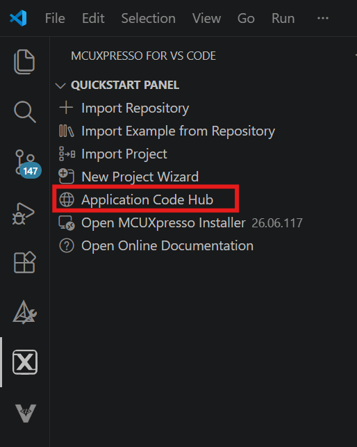
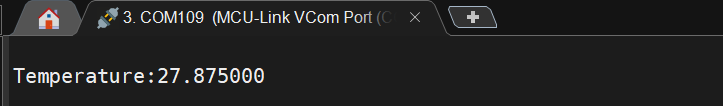

# NXP Application Code Hub

## MCXC162 Low Power Temperature Sensing

This demo presents the low power temperature sensing on FRDM‑MCXC162 platform using an onboard P3T1755 temperature sensor. The application spends most of its time in a low-power state. When the wakeup button is pressed. presence is detected, the MCU transitions to active mode, reads the sensor measurement data,and print through serial port.

The P3T1755 is a temperature-to-digital converter from -40 °C to +125 °C range. It uses an on-chip band gap temperature sensor and A-to-D conversion technique with an overtemperature detection. The device contains a number of configuration and data registers to store the device settings, such as device operation mode, and a temperature register (Temp) to store the digital temp reading that can be communicated by a controller via the 2-wire serial I3C (up to 12.5 MHz) and I2C (up to 3.4 MHz) interface.

#### Boards: FRDM-MCXC162
#### Categories: Low Power
#### Peripherals: I2C
#### Toolchains: MCUXpresso IDE, VS code

## Table of Contents
1. [Software](#step1)
2. [Hardware](#step2)
3. [Setup](#step3)
4. [Results](#step4)
5. [FAQs](#step5) 
6. [Support](#step6)
7. [Release Notes](#step7)

## 1. Software
- Download and install [VS Code V1.133 or later](https://code.visualstudio.com/).
- Download MCUXpresso for VS Code Plugin 26.7.52 or later.
- Download MCU SDK: [SDK_26_06_00_FRDM-MCXC162](https://mcuxpresso.nxp.com/en/welcome) (Optional)

## 2. Hardware
- FRDM-MCXC162
- USB Type-C cable

## 3. Setup
### 3.1 Import project from Application Code Hub
1. Open VS code, open MCUXpresso for VSCode extension.
2. In Quick Start Panel window click in Application Code Hub.
[

]()
3. In Search text field, type the name of this example "MCXC162 Low Power Temperature Sensing
4. Select the example, update the name and select the directory where the example will be saved.
5. Click on the import project and wait some minutes.
6. Add the toolchain: Arm GNU
7. Now you should have the “mcxc162-low-power-temperature-sensing” in your projects panel.

### 3.2 Prepare FRDM board
1. Connect FRDM board to computer with USB-C cable in MCU-Link port of FRDM.

### 3.3 Flash your FRDM board Application
1. Do right click on project "mcxc162-low-power-temperature-sensing" and select pristine build and wait about a one minute.
2. Click run (play icon).  
Note:If you are unable to find MCXC162 within your environment after clicking on "Run" or "Play" , please Go to MCUXpresso Installer and software to latest version specifically the Debug Probes, including Linkserver
3. Please wait a few seconds.
4. Now click stop in center upper button.

## 4. Results
If using VS code serial monitor" -> Open serial monitor -> Click on start monitoring and check the COM port is correct. Then when you click on SW2 you should be able to see the temperature reading on the console. 

[

](./picture/result.png)

#### Project Metadata

<!----- Boards ----->

<!----- Categories ----->

<!----- Peripherals ----->

<!----- Toolchains ----->

Questions regarding the content/correctness of this example can be entered as Issues within this GitHub repository.

>**Note**: For more general technical questions regarding NXP Microcontrollers and the difference in expected functionality, enter your questions on the [NXP Community Forum](https://community.nxp.com/)

## 5. Release Notes
| Version | Description / Update                           | Date                        |
|:-------:|------------------------------------------------|----------------------------:|
| 1.0     | Initial release on Application Code Hub        | August 12th 2026 |
